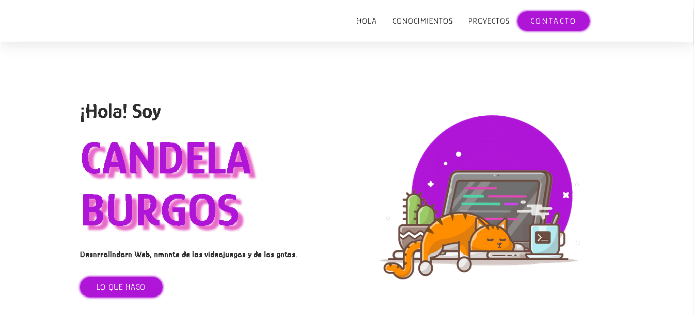
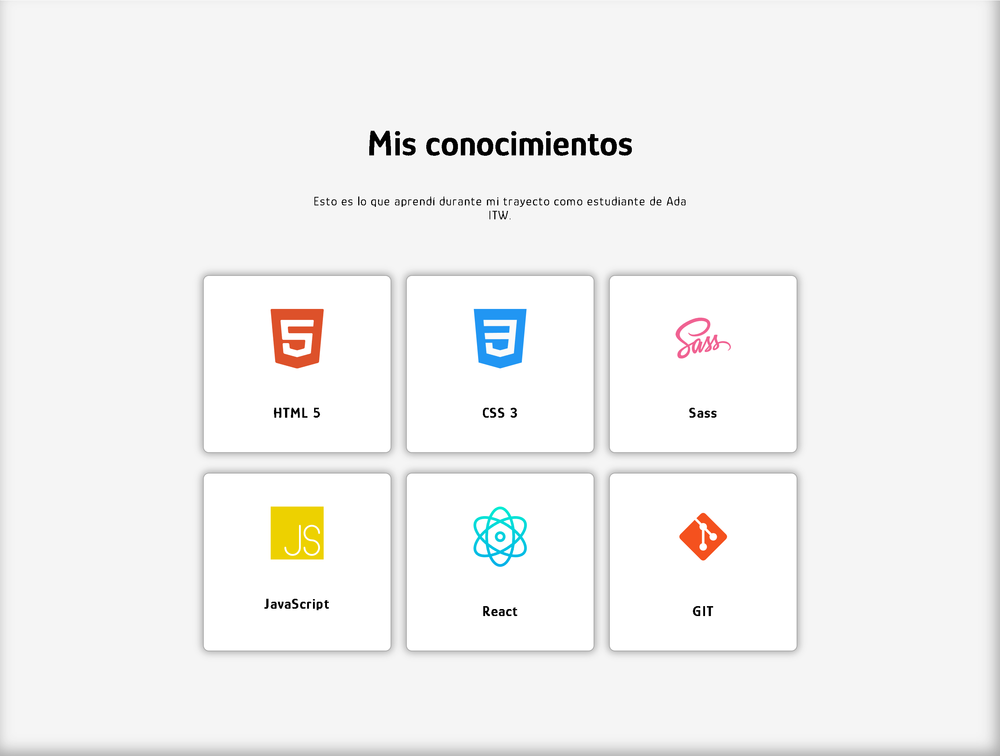
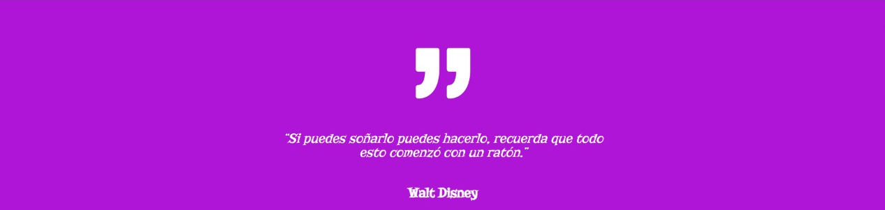
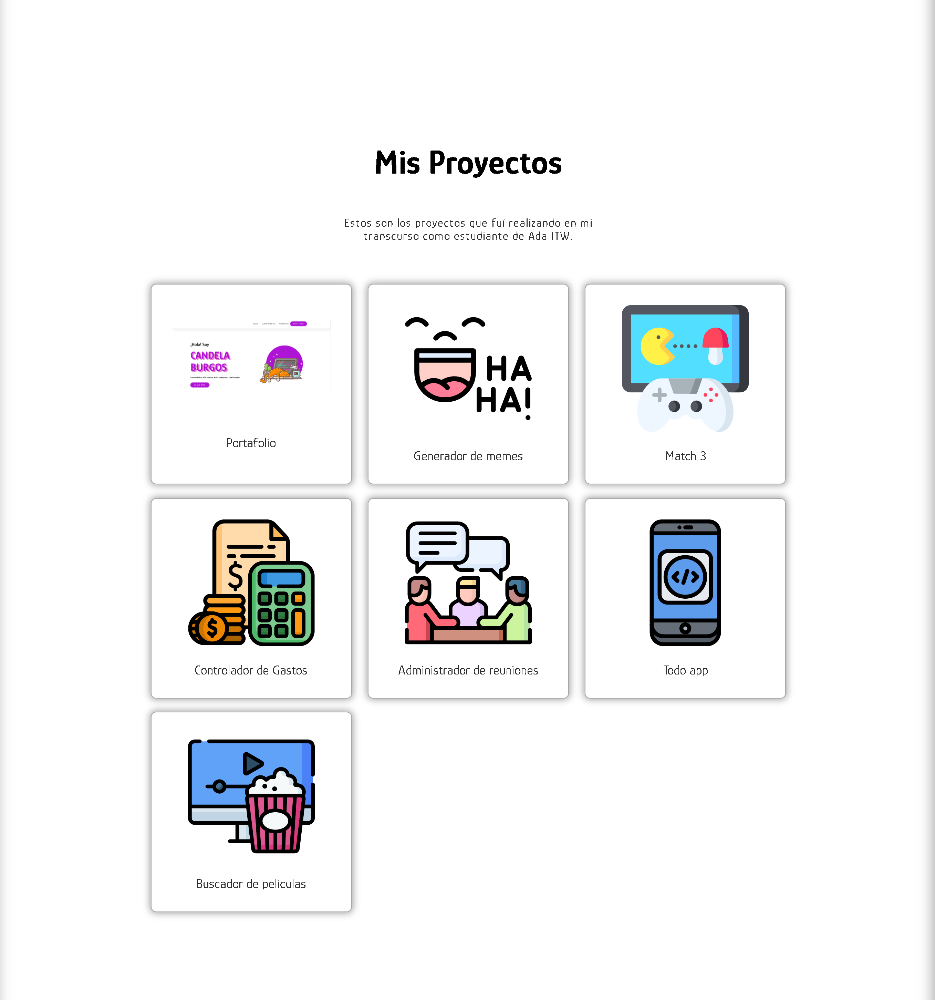
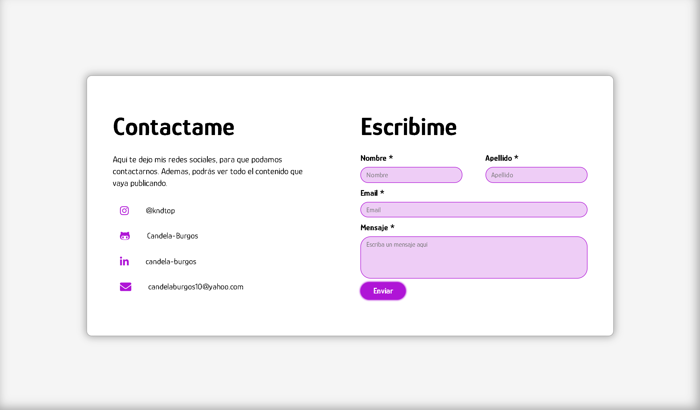

# Mi Portafolio

Este es el proyecto final de la primera etapa del curso de Frontend en Ada ITW.

## Mis secciones:

* [Hola](https://github.com/Candela-Burgos/proyecto_1_Portafolio#hola)
* [Mis conocimientos](https://github.com/Candela-Burgos/proyecto_1_Portafolio#conocimientos)
* [Cita](https://github.com/Candela-Burgos/proyecto_1_Portafolio#cita)
* [Mis proyectos](https://github.com/Candela-Burgos/proyecto_1_Portafolio#proyectos)
* [Contacto](https://github.com/Candela-Burgos/proyecto_1_Portafolio#contacto)

## Hola

En esta sección puedes encontrar información sobre mis gustos y aficiones.

## Conocimientos

En esta sección te muestro todas las tecnologías que aprendí en mi trayecto como estudiante de Ada ITW.

## Cita

## Proyectos

En esta sección te muestro todos los proyectos que hice en mi transcurso como estudiante de Ada ITW.

## Contacto

En esta sección puedes encontrar mis redes sociales, para que puedas comunicarte conmigo.

